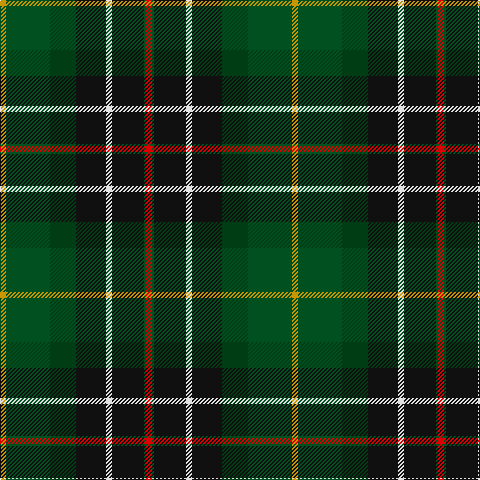

The parent of this is [Lawson, William](/tartans/dy/6/g44/dg26/k30/ln6/k32/g2/r/6/)

This was sourced from register-of-tartans.  It is a [8 stripes tartan](/stripes/stripes8/).

Original link https://www.tartanregister.gov.uk/tartanDetails.aspx?ref=5994

## Thread count
DY/6 G44 DG26 K30 LN6 K32 G2 R/6

## Palette
Each colour and its ΔE from the base-6 reference it is a variant of.

| Colour | Shade | Base | ΔE (OKLab) |
|---|---|---|---|
| DG |  `#003C14` | G  | 0.14 |
| DY |  `#C89600` | Y  | 0.12 |
| G |  `#005020` | G  | 0.08 |
| K |  `#101010` | K  | 0.17 |
| LN |  `#E0E0E0` | W  | 0.06 |
| R |  `#DC0000` | R  | 0.04 |

# Sample pattern

ID: /variants/dy/6/g44/dg26/k30/ln6/k32/g2/r/6-dg003c14-dyc89600-g005020-k101010-lne0e0e0-rdc0000/
