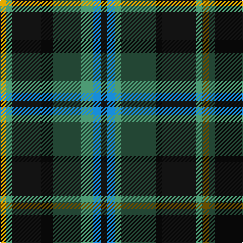

The parent of this is [Michaluk (Personal)](/tartans/dy/6/g6/k40/g40/b8/k/6/)

This was sourced from tartans-authority.  It is a [6 stripes tartan](/stripes/stripes6/).

Original link http://www.tartansauthority.com/tartan-ferret/display/6217/

## Thread count
DY/6 G6 K40 G40 B8 K/6

## Palette
Each colour and its ΔE from the base-6 reference it is a variant of.

| Colour | Shade | Base | ΔE (OKLab) |
|---|---|---|---|
| B |  `#1474B4` | B  | 0.15 |
| DY |  `#BC8C00` | Y  | 0.16 |
| G |  `#408060` | G  | 0.13 |
| K |  `#101010` | K  | 0.17 |

# Sample pattern

ID: /variants/dy/6/g6/k40/g40/b8/k/6-b1474b4-dybc8c00-g408060-k101010/
