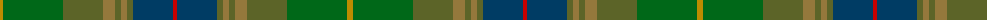

The parent of this is [Glens of Corbie](/tartans/dy/6/g60/ga40/lt12/ga6/lt6/ga6/db40/r/4/)

This was sourced from register-of-tartans.  It is a [9 stripes tartan](/stripes/stripes9/).

Original link https://www.tartanregister.gov.uk/tartanDetails.aspx?ref=1436

## Thread count
DY/6 G60 Ga40 LT12 Ga6 LT6 Ga6 DB40 R/4

## Palette
Each colour and its ΔE from the base-6 reference it is a variant of.

| Colour | Shade | Base | ΔE (OKLab) |
|---|---|---|---|
| DB |  `#003C64` | B  | 0.07 |
| DY |  `#BC8C00` | Y  | 0.16 |
| G |  `#006818` | G  | 0.02 |
| Ga |  `#5C6428` | G  | 0.09 |
| Gb |  `#408060` | G  | 0.13 |
| LT |  `#94783C` | R  | 0.19 |
| R |  `#C80000` | R  | 0.00 |

ID: /variants/dy/6/g60/ga40/lt12/ga6/lt6/ga6/db40/r/4-db003c64-dybc8c00-g006818-ga5c6428-gb408060-lt94783c-rc80000/
