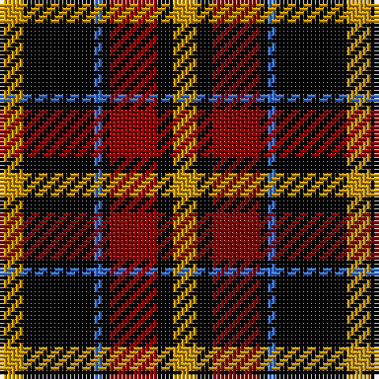

The parent of this is [LP Cover (Dance)](/tartans/dy/6/k18/b2/k2/dr12/k4/dy/6/)

This was sourced from register-of-tartans.  It is a [7 stripes tartan](/stripes/stripes7/).

Original link https://www.tartanregister.gov.uk/tartanDetails.aspx?ref=2240

## Thread count
DY/6 K18 B2 K2 DR12 K4 DY/6

## Palette
Each colour and its ΔE from the base-6 reference it is a variant of.

| Colour | Shade | Base | ΔE (OKLab) |
|---|---|---|---|
| B |  `#3474FC` | B  | 0.23 |
| DR |  `#8C0000` | R  | 0.13 |
| DY |  `#C89800` | Y  | 0.12 |
| K |  `#000000` | K  | 0.00 |

# Sample pattern

ID: /variants/dy/6/k18/b2/k2/dr12/k4/dy/6-b3474fc-dr8c0000-dyc89800-k000000/
