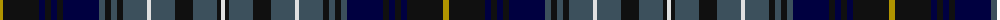

The parent of this is [Van Ingelgem (Personal)](/tartans/dy/6/k36/db6/k6/db6/k6/db36/n6/k6/n6/k6/n24/ln4/n24/k18/n24/k4/ln/4/)

This was sourced from tartans-authority.  It is a [18 stripes tartan](/stripes/stripes18/).

Original link http://www.tartansauthority.com/tartan-ferret/display/7220/

## Thread count
DY/6 K36 DB6 K6 DB6 K6 DB36 N6 K6 N6 K6 N24 LN4 N24 K18 N24 K4 LN/4

## Palette
Each colour and its ΔE from the base-6 reference it is a variant of.

| Colour | Shade | Base | ΔE (OKLab) |
|---|---|---|---|
| DB |  `#000040` | K  | 0.20 |
| DY |  `#B09400` | Y  | 0.15 |
| K |  `#101010` | K  | 0.17 |
| LN |  `#E0E0E0` | W  | 0.06 |
| N |  `#3C505C` | B  | 0.10 |

ID: /variants/dy/6/k36/db6/k6/db6/k6/db36/n6/k6/n6/k6/n24/ln4/n24/k18/n24/k4/ln/4-db000040-dyb09400-k101010-lne0e0e0-n3c505c/
