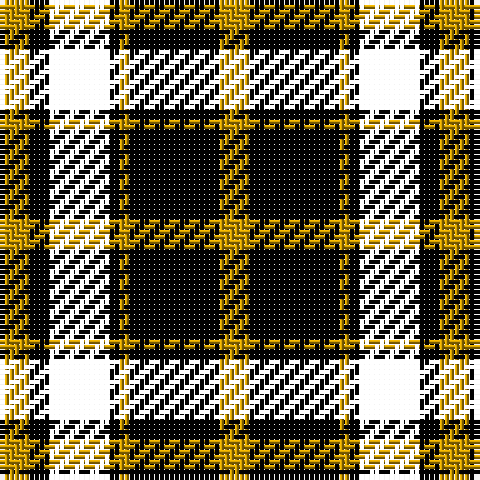

The parent of this is [LP Cover (Dance)](/tartans/dy/6/k4/dr12/k2/dya2/k18/dy/6/)

This was sourced from tartans-authority.  It is a [7 stripes tartan](/stripes/stripes7/).

Original link http://www.tartansauthority.com/tartan-ferret/display/4949/

## Thread count
DY/6 K4 DR12 K2 DYa2 K18 DY/6

## Palette
Each colour and its ΔE from the base-6 reference it is a variant of.

| Colour | Shade | Base | ΔE (OKLab) |
|---|---|---|---|
| DY |  `#C89800` | Y  | 0.12 |
| DYa |  `#C89800` | Y  | 0.12 |
| K |  `#000000` | K  | 0.00 |

# Sample pattern

ID: /variants/dy/6/k4/dr12/k2/dya2/k18/dy/6-dyc89800-dyac89800-k000000/
