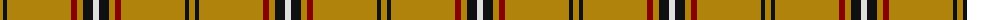

The parent of this is [Bro-Dreger (Corporate)](/tartans/dy/6/k4/dy64/dr6/dy6/k10/ln/6/)

This was sourced from tartans-authority.  It is a [7 stripes tartan](/stripes/stripes7/).

Original link http://www.tartansauthority.com/tartan-ferret/display/6650/

## Thread count
DY/6 K4 DY64 DR6 DY6 K10 LN/6

## Palette
Each colour and its ΔE from the base-6 reference it is a variant of.

| Colour | Shade | Base | ΔE (OKLab) |
|---|---|---|---|
| DR |  `#880000` | R  | 0.14 |
| DY |  `#B0840C` | Y  | 0.19 |
| K |  `#101010` | K  | 0.17 |
| LN |  `#E0E0E0` | W  | 0.06 |

# Sample pattern

ID: /variants/dy/6/k4/dy64/dr6/dy6/k10/ln/6-dr880000-dyb0840c-k101010-lne0e0e0/
