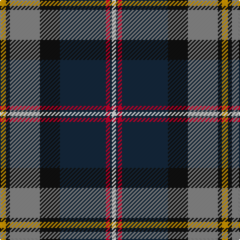

The parent of this is [Vienna Highlander (Fashion)](/tartans/dy/6/k4/n30/k20/dn46/r4/dn2/w/4/)

This was sourced from tartans-authority.  It is a [8 stripes tartan](/stripes/stripes8/).

Original link http://www.tartansauthority.com/tartan-ferret/display/6024/

## Thread count
DY/6 K4 N30 K20 DN46 R4 DN2 W/4

## Palette
Each colour and its ΔE from the base-6 reference it is a variant of.

| Colour | Shade | Base | ΔE (OKLab) |
|---|---|---|---|
| DN |  `#14283C` | B  | 0.14 |
| DY |  `#D09800` | Y  | 0.11 |
| K |  `#101010` | K  | 0.17 |
| N |  `#888888` | R  | 0.24 |
| R |  `#C8002C` | R  | 0.03 |
| W |  `#FCFCFC` | W  | 0.03 |

# Sample pattern

ID: /variants/dy/6/k4/n30/k20/dn46/r4/dn2/w/4-dn14283c-dyd09800-k101010-n888888-rc8002c-wfcfcfc/
