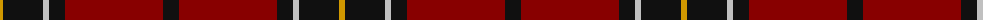

The parent of this is [Dunbar (District)](/tartans/dy/6/k40/n6/k16/dr98/k/16/)

This was sourced from tartans-authority.  It is a [6 stripes tartan](/stripes/stripes6/).

Original link http://www.tartansauthority.com/tartan-ferret/display/2011/

## Thread count
DY/6 K40 N6 K16 DR98 K/16

## Palette
Each colour and its ΔE from the base-6 reference it is a variant of.

| Colour | Shade | Base | ΔE (OKLab) |
|---|---|---|---|
| DR |  `#880000` | R  | 0.14 |
| DY |  `#D09800` | Y  | 0.11 |
| K |  `#101010` | K  | 0.17 |
| N |  `#C0C0C0` | W  | 0.16 |

# Sample pattern

ID: /variants/dy/6/k40/n6/k16/dr98/k/16-dr880000-dyd09800-k101010-nc0c0c0/
