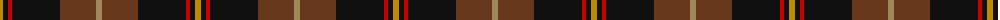
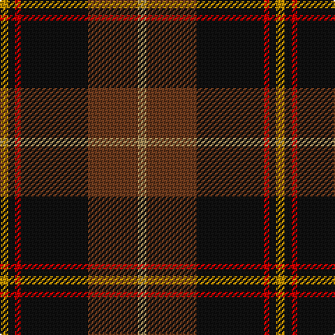

The parent of this is [Drambuie Htg (Corporate)](/tartans/dy/6/k5/r4/k48/t36/lt/6/)

This was sourced from tartans-authority.  It is a [6 stripes tartan](/stripes/stripes6/).

Original link http://www.tartansauthority.com/tartan-ferret/display/2475/

## Thread count
DY/6 K5 R4 K48 T36 LT/6

## Palette
Each colour and its ΔE from the base-6 reference it is a variant of.

| Colour | Shade | Base | ΔE (OKLab) |
|---|---|---|---|
| DY |  `#BC8C00` | Y  | 0.16 |
| K |  `#101010` | K  | 0.17 |
| LT |  `#A08858` | Y  | 0.21 |
| R |  `#C80000` | R  | 0.00 |
| T |  `#68381C` | G  | 0.18 |

# Sample pattern

ID: /variants/dy/6/k5/r4/k48/t36/lt/6-dybc8c00-k101010-lta08858-rc80000-t68381c/
