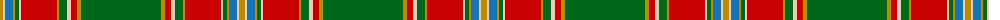

The parent of this is [Morgan Jocelyn . . . (Personal)](/tartans/dy/6/lr2/b8/dy2/g4/lr2/r36/dy2/g8/lr4/r6/dy4/g/80/)

This was sourced from tartans-authority.  It is a [13 stripes tartan](/stripes/stripes13/).

Original link http://www.tartansauthority.com/tartan-ferret/display/10809/

## Thread count
DY/6 LR2 B8 DY2 G4 LR2 R36 DY2 G8 LR4 R6 DY4 G/80

## Palette
Each colour and its ΔE from the base-6 reference it is a variant of.

| Colour | Shade | Base | ΔE (OKLab) |
|---|---|---|---|
| B |  `#1474B4` | B  | 0.15 |
| DY |  `#BC8C00` | Y  | 0.16 |
| G |  `#006818` | G  | 0.02 |
| LR |  `#E8CCB8` | W  | 0.11 |
| R |  `#C80000` | R  | 0.00 |

ID: /variants/dy/6/lr2/b8/dy2/g4/lr2/r36/dy2/g8/lr4/r6/dy4/g/80-b1474b4-dybc8c00-g006818-lre8ccb8-rc80000/
