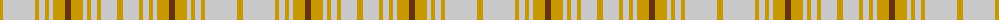

The parent of this is [Clanedin (Commemorative)](/tartans/dy/6/n20/na4/n8/dy4/n6/dy4/n4/dy12/t6/dy12/n4/dy4/n6/dy4/n16/dya/6/)

This was sourced from tartans-authority.  It is a [17 stripes tartan](/stripes/stripes17/).

Original link http://www.tartansauthority.com/tartan-ferret/display/1619/

## Thread count
DY/6 N20 Na4 N8 DY4 N6 DY4 N4 DY12 T6 DY12 N4 DY4 N6 DY4 N16 DYa/6

## Palette
Each colour and its ΔE from the base-6 reference it is a variant of.

| Colour | Shade | Base | ΔE (OKLab) |
|---|---|---|---|
| DY |  `#C89800` | Y  | 0.12 |
| DYa |  `#C89800` | Y  | 0.12 |
| N |  `#C8C8C8` | W  | 0.13 |
| Na |  `#C8C8C8` | W  | 0.13 |
| T |  `#64340C` | G  | 0.18 |

ID: /variants/dy/6/n20/na4/n8/dy4/n6/dy4/n4/dy12/t6/dy12/n4/dy4/n6/dy4/n16/dya/6-dyc89800-dyac89800-nc8c8c8-nac8c8c8-t64340c/
