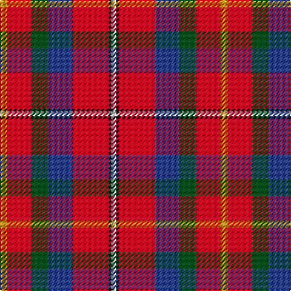

The parent of this is [East Kilbride](/tartans/dy/6/r20/g14/b20/r30/k2/ln/4/)

This was sourced from register-of-tartans.  It is a [7 stripes tartan](/stripes/stripes7/).

Original link https://www.tartanregister.gov.uk/tartanDetails.aspx?ref=1066

## Thread count
DY/6 R20 G14 B20 R30 K2 LN/4

## Palette
Each colour and its ΔE from the base-6 reference it is a variant of.

| Colour | Shade | Base | ΔE (OKLab) |
|---|---|---|---|
| B |  `#2C4084` | B  | 0.00 |
| DY |  `#C89600` | Y  | 0.12 |
| G |  `#005020` | G  | 0.08 |
| K |  `#101010` | K  | 0.17 |
| LN |  `#E0E0E0` | W  | 0.06 |
| R |  `#C80028` | R  | 0.02 |

# Sample pattern

ID: /variants/dy/6/r20/g14/b20/r30/k2/ln/4-b2c4084-dyc89600-g005020-k101010-lne0e0e0-rc80028/
