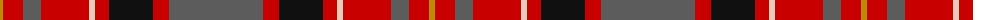

The parent of this is [Ulster Ancestry (Fashion)](/tartans/dy/6/r20/n18/r48/lr6/r14/k44/r16/n/94/)

This was sourced from tartans-authority.  It is a [9 stripes tartan](/stripes/stripes9/).

Original link http://www.tartansauthority.com/tartan-ferret/display/10800/

## Thread count
DY/6 R20 N18 R48 LR6 R14 K44 R16 N/94

## Palette
Each colour and its ΔE from the base-6 reference it is a variant of.

| Colour | Shade | Base | ΔE (OKLab) |
|---|---|---|---|
| DY |  `#BC8C00` | Y  | 0.16 |
| K |  `#101010` | K  | 0.17 |
| LR |  `#E8CCB8` | W  | 0.11 |
| N |  `#5C5C5C` | B  | 0.14 |
| R |  `#C80000` | R  | 0.00 |

ID: /variants/dy/6/r20/n18/r48/lr6/r14/k44/r16/n/94-dybc8c00-k101010-lre8ccb8-n5c5c5c-rc80000/
