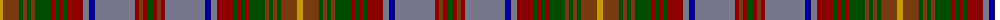

The parent of this is [Wcwm 1528](/tartans/dy/6/t16/g4/t4/g4/t4/g16/dr4/g4/dr4/g4/dr16/n6/db6/n40/dr4/t4/dr4/g/6/)

This was sourced from register-of-tartans.  It is a [19 stripes tartan](/stripes/stripes19/).

Original link https://www.tartanregister.gov.uk/tartanDetails.aspx?ref=4527

## Thread count
DY/6 T16 G4 T4 G4 T4 G16 DR4 G4 DR4 G4 DR16 N6 DB6 N40 DR4 T4 DR4 G/6

## Palette
Each colour and its ΔE from the base-6 reference it is a variant of.

| Colour | Shade | Base | ΔE (OKLab) |
|---|---|---|---|
| DB |  `#00008C` | B  | 0.13 |
| DR |  `#8C0000` | R  | 0.13 |
| DY |  `#C89800` | Y  | 0.12 |
| G |  `#004C00` | G  | 0.08 |
| N |  `#78788C` | B  | 0.21 |
| T |  `#783C10` | R  | 0.16 |

ID: /variants/dy/6/t16/g4/t4/g4/t4/g16/dr4/g4/dr4/g4/dr16/n6/db6/n40/dr4/t4/dr4/g/6-db00008c-dr8c0000-dyc89800-g004c00-n78788c-t783c10/
