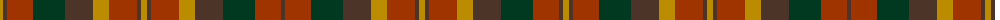

The parent of this is [Monaghan, County](/tartans/dy/6/t4/r26/dg32/t28/dy16/r28/t4/dy6/t4/r28/dy16/t28/dg32/r26/t/4/)

This was sourced from register-of-tartans.  It is a [16 stripes tartan](/stripes/stripes16/).

Original link https://www.tartanregister.gov.uk/tartanDetails.aspx?ref=2977

## Thread count
DY/6 T4 R26 DG32 T28 DY16 R28 T4 DY6 T4 R28 DY16 T28 DG32 R26 T/4

## Palette
Each colour and its ΔE from the base-6 reference it is a variant of.

| Colour | Shade | Base | ΔE (OKLab) |
|---|---|---|---|
| DG |  `#003820` | G  | 0.16 |
| DY |  `#BC8C00` | Y  | 0.16 |
| R |  `#A03400` | R  | 0.08 |
| T |  `#4C3428` | B  | 0.16 |

ID: /variants/dy/6/t4/r26/dg32/t28/dy16/r28/t4/dy6/t4/r28/dy16/t28/dg32/r26/t/4-dg003820-dybc8c00-ra03400-t4c3428/
