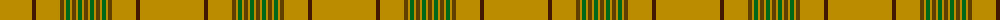

The parent of this is [Houston (Personal)](/tartans/dy/64/dr4/dy24/t4/dy2/g4/dy2/t4/dy2/g4/dy2/t/4/)

This was sourced from tartans-authority.  It is a [12 stripes tartan](/stripes/stripes12/).

Original link http://www.tartansauthority.com/tartan-ferret/display/6043/

## Thread count
DY/64 DR4 DY24 T4 DY2 G4 DY2 T4 DY2 G4 DY2 T/4

## Palette
Each colour and its ΔE from the base-6 reference it is a variant of.

| Colour | Shade | Base | ΔE (OKLab) |
|---|---|---|---|
| DR |  `#441800` | B  | 0.22 |
| DY |  `#BC8C00` | Y  | 0.16 |
| G |  `#006818` | G  | 0.02 |
| T |  `#604000` | G  | 0.14 |

ID: /variants/dy/64/dr4/dy24/t4/dy2/g4/dy2/t4/dy2/g4/dy2/t/4-dr441800-dybc8c00-g006818-t604000/
