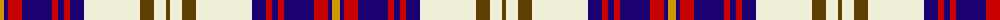

The parent of this is [Walker, Dress (Name)](/tartans/dy/8/db4/r14/db30/r6/db6/r6/db14/ly56/t14/ly12/t/4/)

This was sourced from tartans-authority.  It is a [12 stripes tartan](/stripes/stripes12/).

Original link http://www.tartansauthority.com/tartan-ferret/display/2070/

## Thread count
DY/8 DB4 R14 DB30 R6 DB6 R6 DB14 LY56 T14 LY12 T/4

## Palette
Each colour and its ΔE from the base-6 reference it is a variant of.

| Colour | Shade | Base | ΔE (OKLab) |
|---|---|---|---|
| DB |  `#1C0070` | B  | 0.14 |
| DY |  `#D09800` | Y  | 0.11 |
| LY |  `#F0F0D8` | W  | 0.03 |
| R |  `#C80000` | R  | 0.00 |
| T |  `#604000` | G  | 0.14 |

ID: /variants/dy/8/db4/r14/db30/r6/db6/r6/db14/ly56/t14/ly12/t/4-db1c0070-dyd09800-lyf0f0d8-rc80000-t604000/
