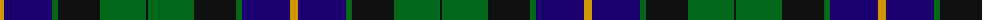

The parent of this is [Glenturret Distillery (Corporate)](/tartans/dy/8/db48/g6/k42/g46/k/2/)

This was sourced from tartans-authority.  It is a [6 stripes tartan](/stripes/stripes6/).

Original link http://www.tartansauthority.com/tartan-ferret/display/1097/

## Thread count
DY/8 DB48 G6 K42 G46 K/2

## Palette
Each colour and its ΔE from the base-6 reference it is a variant of.

| Colour | Shade | Base | ΔE (OKLab) |
|---|---|---|---|
| DB |  `#1C0070` | B  | 0.14 |
| DY |  `#D09800` | Y  | 0.11 |
| G |  `#006818` | G  | 0.02 |
| K |  `#101010` | K  | 0.17 |

# Sample pattern

ID: /variants/dy/8/db48/g6/k42/g46/k/2-db1c0070-dyd09800-g006818-k101010/
