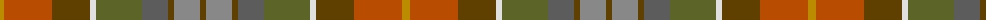

The parent of this is [Teallach (Personal)](/tartans/dy/8/do48/t38/ln6/g46/n26/t6/na26/t/6/)

This was sourced from tartans-authority.  It is a [9 stripes tartan](/stripes/stripes9/).

Original link http://www.tartansauthority.com/tartan-ferret/display/832/

## Thread count
DY/8 DO48 T38 LN6 G46 N26 T6 Na26 T/6

## Palette
Each colour and its ΔE from the base-6 reference it is a variant of.

| Colour | Shade | Base | ΔE (OKLab) |
|---|---|---|---|
| DO |  `#B84C00` | R  | 0.08 |
| DY |  `#BC8C00` | Y  | 0.16 |
| G |  `#5C6428` | G  | 0.09 |
| LN |  `#E0E0E0` | W  | 0.06 |
| N |  `#5C5C5C` | B  | 0.14 |
| Na |  `#888888` | R  | 0.24 |
| T |  `#604000` | G  | 0.14 |

ID: /variants/dy/8/do48/t38/ln6/g46/n26/t6/na26/t/6-dob84c00-dybc8c00-g5c6428-lne0e0e0-n5c5c5c-na888888-t604000/
