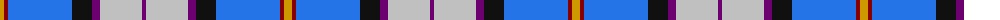

The parent of this is [Dignan Corporate School Tartan Tartan Number: 2358. Earliest known date: 1997 For a Mrs Pam Dignan who owns the Dignan School of Dancing. See products available Copyright © Blair Urquhart, Comrie, 2015](/tartans/dy/8/dr4/b64/k20/p8/n42/p/4/)

This was sourced from house-of-tartan.  It is a [7 stripes tartan](/stripes/stripes7/).

Original link http://www.house-of-tartan.scotland.net/house/TartanViewjs.asp?colr=Def&tnam=2358

## Thread count
DY/8 DR4 B64 K20 P8 N42 P/4

## Palette
Each colour and its ΔE from the base-6 reference it is a variant of.

| Colour | Shade | Base | ΔE (OKLab) |
|---|---|---|---|
| B |  `#2474E8` | B  | 0.20 |
| DR |  `#880000` | R  | 0.14 |
| DY |  `#D09800` | Y  | 0.11 |
| K |  `#101010` | K  | 0.17 |
| N |  `#C0C0C0` | W  | 0.16 |
| P |  `#6C0070` | B  | 0.15 |

# Sample pattern

ID: /variants/dy/8/dr4/b64/k20/p8/n42/p/4-b2474e8-dr880000-dyd09800-k101010-nc0c0c0-p6c0070/
