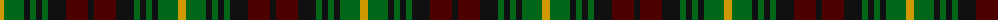

The parent of this is [Martin (Name)](/tartans/dy/8/g20/k6/g6/k6/g6/k18/dr22/k/6/)

This was sourced from tartans-authority.  It is a [9 stripes tartan](/stripes/stripes9/).

Original link http://www.tartansauthority.com/tartan-ferret/display/1207/

## Thread count
DY/8 G20 K6 G6 K6 G6 K18 DR22 K/6

## Palette
Each colour and its ΔE from the base-6 reference it is a variant of.

| Colour | Shade | Base | ΔE (OKLab) |
|---|---|---|---|
| DR |  `#4C0000` | B  | 0.24 |
| DY |  `#D09800` | Y  | 0.11 |
| G |  `#006818` | G  | 0.02 |
| K |  `#101010` | K  | 0.17 |

ID: /variants/dy/8/g20/k6/g6/k6/g6/k18/dr22/k/6-dr4c0000-dyd09800-g006818-k101010/
