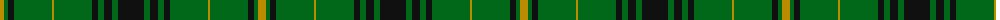

The parent of this is [American Monahan (Personal)](/tartans/dy/8/g4/k6/g38/dy2/g38/k6/g6/k8/g6/k/26/)

This was sourced from tartans-authority.  It is a [11 stripes tartan](/stripes/stripes11/).

Original link http://www.tartansauthority.com/tartan-ferret/display/8515/

## Thread count
DY/8 G4 K6 G38 DY2 G38 K6 G6 K8 G6 K/26

## Palette
Each colour and its ΔE from the base-6 reference it is a variant of.

| Colour | Shade | Base | ΔE (OKLab) |
|---|---|---|---|
| DY |  `#BC8C00` | Y  | 0.16 |
| G |  `#006818` | G  | 0.02 |
| K |  `#101010` | K  | 0.17 |

ID: /variants/dy/8/g4/k6/g38/dy2/g38/k6/g6/k8/g6/k/26-dybc8c00-g006818-k101010/
