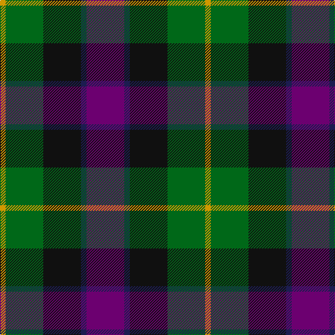

The parent of this is [Selkirk (Personal)](/tartans/dy/8/g54/k54/db8/p/54/)

This was sourced from tartans-authority.  It is a [5 stripes tartan](/stripes/stripes5/).

Original link http://www.tartansauthority.com/tartan-ferret/display/3195/

## Thread count
DY/8 G54 K54 DB8 P/54

## Palette
Each colour and its ΔE from the base-6 reference it is a variant of.

| Colour | Shade | Base | ΔE (OKLab) |
|---|---|---|---|
| DB |  `#1C1C50` | B  | 0.14 |
| DY |  `#D09800` | Y  | 0.11 |
| G |  `#006818` | G  | 0.02 |
| K |  `#101010` | K  | 0.17 |
| P |  `#6C0070` | B  | 0.15 |

# Sample pattern

ID: /variants/dy/8/g54/k54/db8/p/54-db1c1c50-dyd09800-g006818-k101010-p6c0070/
