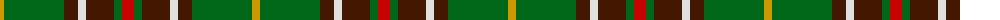
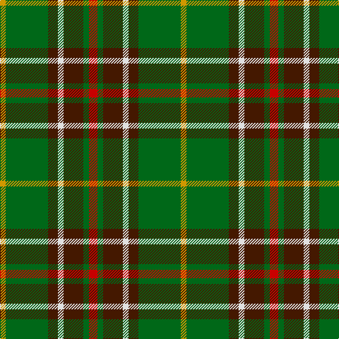

The parent of this is [Newfoundland](/tartans/dy/8/g60/dr14/ln8/dr28/g8/r/12/)

This was sourced from register-of-tartans.  It is a [7 stripes tartan](/stripes/stripes7/).

Original link https://www.tartanregister.gov.uk/tartanDetails.aspx?ref=3127

## Thread count
DY/8 G60 DR14 LN8 DR28 G8 R/12

## Palette
Each colour and its ΔE from the base-6 reference it is a variant of.

| Colour | Shade | Base | ΔE (OKLab) |
|---|---|---|---|
| DR |  `#441800` | B  | 0.22 |
| DY |  `#D09800` | Y  | 0.11 |
| G |  `#006818` | G  | 0.02 |
| LN |  `#E0E0E0` | W  | 0.06 |
| R |  `#C80000` | R  | 0.00 |

# Sample pattern

ID: /variants/dy/8/g60/dr14/ln8/dr28/g8/r/12-dr441800-dyd09800-g006818-lne0e0e0-rc80000/
