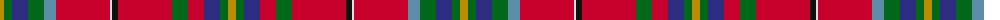

The parent of this is [West Virginia State American District Tartan Tartan Number: 7631. Earliest known date: May 2008 Adapted from 4252 - West Virginia Shawl by Dr Phil Smith and John A Grant III. Adopted by the West Virginia senate (HCR #29) on March 6th 2008. Part of the resolution reads: "Whereas, In order to complement our mountain state the color red is to represent the cardinal (State bird); yellow for the fall colors; dark blue for the mountain rivers and lakes; black for the black bear, coal and oil; green for the rhododendron and mountain meadows; azure for the sky above; and white to have all the colors of this great nation intertwined with the State of West Virginia; therefore, be it Resolved by the Legislature of West Virginia: That the adaption, as described above, of the West Virgina Shawl be designated the Official Tartan of the State of West Virginia." See products available Copyright © Blair Urquhart, Comrie, 2015](/tartans/dy/8/g8/db16/g16/b12/r54/ln2/k6/r54/g16/r16/db16/g8/dy/8/)

This was sourced from house-of-tartan.  It is a [14 stripes tartan](/stripes/stripes14/).

Original link http://www.house-of-tartan.scotland.net/house/TartanViewjs.asp?colr=Def&tnam=7631

## Thread count
DY/8 G8 DB16 G16 B12 R54 LN2 K6 R54 G16 R16 DB16 G8 DY/8

## Palette
Each colour and its ΔE from the base-6 reference it is a variant of.

| Colour | Shade | Base | ΔE (OKLab) |
|---|---|---|---|
| B |  `#5C8CA8` | B  | 0.23 |
| DB |  `#2C2C80` | B  | 0.05 |
| DY |  `#BC8C00` | Y  | 0.16 |
| G |  `#006818` | G  | 0.02 |
| K |  `#101010` | K  | 0.17 |
| LN |  `#E0E0E0` | W  | 0.06 |
| R |  `#C8002C` | R  | 0.03 |

ID: /variants/dy/8/g8/db16/g16/b12/r54/ln2/k6/r54/g16/r16/db16/g8/dy/8-b5c8ca8-db2c2c80-dybc8c00-g006818-k101010-lne0e0e0-rc8002c/
