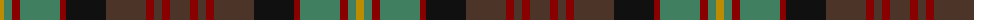

The parent of this is [Cameron of Erracht (WCWM)](/tartans/dy/8/g8/dr8/g40/dr6/k40/t40/dr8/t8/dr8/t/20/)

This was sourced from register-of-tartans.  It is a [11 stripes tartan](/stripes/stripes11/).

Original link https://www.tartanregister.gov.uk/tartanDetails.aspx?ref=5258

## Thread count
DY/8 G8 DR8 G40 DR6 K40 T40 DR8 T8 DR8 T/20

## Palette
Each colour and its ΔE from the base-6 reference it is a variant of.

| Colour | Shade | Base | ΔE (OKLab) |
|---|---|---|---|
| DR |  `#880000` | R  | 0.14 |
| DY |  `#BC8C00` | Y  | 0.16 |
| G |  `#408060` | G  | 0.13 |
| K |  `#101010` | K  | 0.17 |
| T |  `#4C3428` | B  | 0.16 |

ID: /variants/dy/8/g8/dr8/g40/dr6/k40/t40/dr8/t8/dr8/t/20-dr880000-dybc8c00-g408060-k101010-t4c3428/
