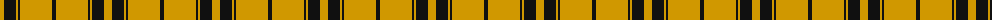

The parent of this is [Monoch Airline (Corporate)](/tartans/dy/8/k12/dy2/k2/dy32/k/4/)

This was sourced from tartans-authority.  It is a [6 stripes tartan](/stripes/stripes6/).

Original link http://www.tartansauthority.com/tartan-ferret/display/4213/

## Thread count
DY/8 K12 DY2 K2 DY32 K/4

## Palette
Each colour and its ΔE from the base-6 reference it is a variant of.

| Colour | Shade | Base | ΔE (OKLab) |
|---|---|---|---|
| DY |  `#D09800` | Y  | 0.11 |
| K |  `#101010` | K  | 0.17 |

# Sample pattern

ID: /variants/dy/8/k12/dy2/k2/dy32/k/4-dyd09800-k101010/
