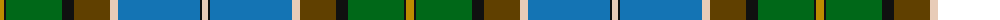

The parent of this is [State Seal of Pennsylvania (Fashion)](/tartans/dy/8/k2/g56/k12/t36/lr8/b82/k2/lr/6/)

This was sourced from tartans-authority.  It is a [9 stripes tartan](/stripes/stripes9/).

Original link http://www.tartansauthority.com/tartan-ferret/display/8652/

## Thread count
DY/8 K2 G56 K12 T36 LR8 B82 K2 LR/6

## Palette
Each colour and its ΔE from the base-6 reference it is a variant of.

| Colour | Shade | Base | ΔE (OKLab) |
|---|---|---|---|
| B |  `#1474B4` | B  | 0.15 |
| DY |  `#BC8C00` | Y  | 0.16 |
| G |  `#006818` | G  | 0.02 |
| K |  `#101010` | K  | 0.17 |
| LR |  `#E8CCB8` | W  | 0.11 |
| T |  `#604000` | G  | 0.14 |

ID: /variants/dy/8/k2/g56/k12/t36/lr8/b82/k2/lr/6-b1474b4-dybc8c00-g006818-k101010-lre8ccb8-t604000/
