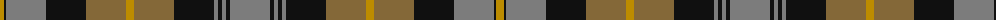

The parent of this is [MacIsaac (Name?)](/tartans/dy/8/k2/n40/k40/lt40/dy8/lt40/k40/n4/k4/n4/k4/n/40/)

This was sourced from tartans-authority.  It is a [13 stripes tartan](/stripes/stripes13/).

Original link http://www.tartansauthority.com/tartan-ferret/display/7514/

## Thread count
DY/8 K2 N40 K40 LT40 DY8 LT40 K40 N4 K4 N4 K4 N/40

## Palette
Each colour and its ΔE from the base-6 reference it is a variant of.

| Colour | Shade | Base | ΔE (OKLab) |
|---|---|---|---|
| DY |  `#BC8C00` | Y  | 0.16 |
| K |  `#101010` | K  | 0.17 |
| LT |  `#846838` | G  | 0.16 |
| N |  `#7C7C7C` | G  | 0.21 |

ID: /variants/dy/8/k2/n40/k40/lt40/dy8/lt40/k40/n4/k4/n4/k4/n/40-dybc8c00-k101010-lt846838-n7c7c7c/
