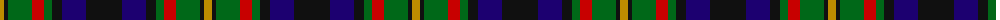
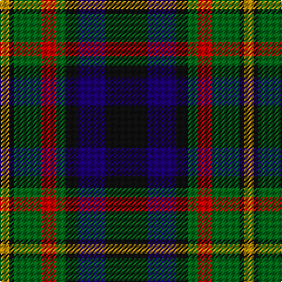

The parent of this is [MacLeish (Clan)](/tartans/dy/8/k4/g24/r12/g8/k10/db24/k/36/)

This was sourced from tartans-authority.  It is a [8 stripes tartan](/stripes/stripes8/).

Original link http://www.tartansauthority.com/tartan-ferret/display/5689/

## Thread count
DY/8 K4 G24 R12 G8 K10 DB24 K/36

## Palette
Each colour and its ΔE from the base-6 reference it is a variant of.

| Colour | Shade | Base | ΔE (OKLab) |
|---|---|---|---|
| DB |  `#1C0070` | B  | 0.14 |
| DY |  `#BC8C00` | Y  | 0.16 |
| G |  `#006818` | G  | 0.02 |
| K |  `#101010` | K  | 0.17 |
| R |  `#C80000` | R  | 0.00 |

# Sample pattern

ID: /variants/dy/8/k4/g24/r12/g8/k10/db24/k/36-db1c0070-dybc8c00-g006818-k101010-rc80000/
