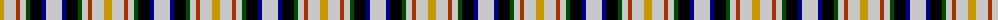
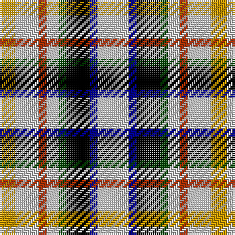

The parent of this is [MacLaren Albino (Dance)](/tartans/dy/8/n12/r4/n6/g4/k12/db4/n/16/)

This was sourced from register-of-tartans.  It is a [8 stripes tartan](/stripes/stripes8/).

Original link https://www.tartanregister.gov.uk/tartanDetails.aspx?ref=2598

## Thread count
DY/8 N12 R4 N6 G4 K12 DB4 N/16

## Palette
Each colour and its ΔE from the base-6 reference it is a variant of.

| Colour | Shade | Base | ΔE (OKLab) |
|---|---|---|---|
| DB |  `#00008C` | B  | 0.13 |
| DY |  `#C89800` | Y  | 0.12 |
| G |  `#004C00` | G  | 0.08 |
| K |  `#000000` | K  | 0.00 |
| N |  `#C8C8C8` | W  | 0.13 |
| R |  `#A83000` | R  | 0.07 |

# Sample pattern

ID: /variants/dy/8/n12/r4/n6/g4/k12/db4/n/16-db00008c-dyc89800-g004c00-k000000-nc8c8c8-ra83000/
