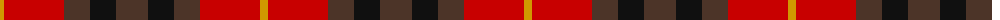
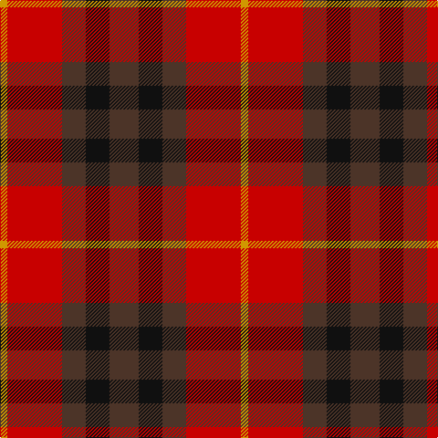

The parent of this is [Highland Pub Company Corporate Tartan Tartan Number: 2289. Earliest known date: 1996 Designed by Polly Wittering of The House of Edgar for the Highland Pub Co, part of Scottish & Newcastle Breweries. See products available Copyright © Blair Urquhart, Comrie, 2015](/tartans/dy/8/r60/t26/k26/t/32/)

This was sourced from house-of-tartan.  It is a [5 stripes tartan](/stripes/stripes5/).

Original link http://www.house-of-tartan.scotland.net/house/TartanViewjs.asp?colr=Def&tnam=2289

## Thread count
DY/8 R60 T26 K26 T/32

## Palette
Each colour and its ΔE from the base-6 reference it is a variant of.

| Colour | Shade | Base | ΔE (OKLab) |
|---|---|---|---|
| DY |  `#D09800` | Y  | 0.11 |
| K |  `#101010` | K  | 0.17 |
| R |  `#C80000` | R  | 0.00 |
| T |  `#4C3428` | B  | 0.16 |

# Sample pattern

ID: /variants/dy/8/r60/t26/k26/t/32-dyd09800-k101010-rc80000-t4c3428/
