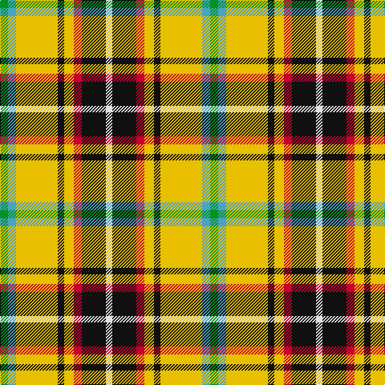

The parent of this is [Cornish Christophers (Personal)](/tartans/g/10/b10/y52/k8/y12/r10/k30/ln/8/)

This was sourced from tartans-authority.  It is a [8 stripes tartan](/stripes/stripes8/).

Original link http://www.tartansauthority.com/tartan-ferret/display/4044/

## Thread count
G/10 B10 Y52 K8 Y12 R10 K30 LN/8

## Palette
Each colour and its ΔE from the base-6 reference it is a variant of.

| Colour | Shade | Base | ΔE (OKLab) |
|---|---|---|---|
| B |  `#48A4C0` | Y  | 0.28 |
| G |  `#009420` | G  | 0.15 |
| K |  `#101010` | K  | 0.17 |
| LN |  `#E0E0E0` | W  | 0.06 |
| R |  `#C8002C` | R  | 0.03 |
| Y |  `#E8C000` | Y  | 0.00 |

# Sample pattern

ID: /variants/g/10/b10/y52/k8/y12/r10/k30/ln/8-b48a4c0-g009420-k101010-lne0e0e0-rc8002c-ye8c000/
