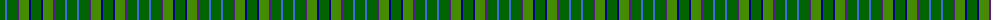
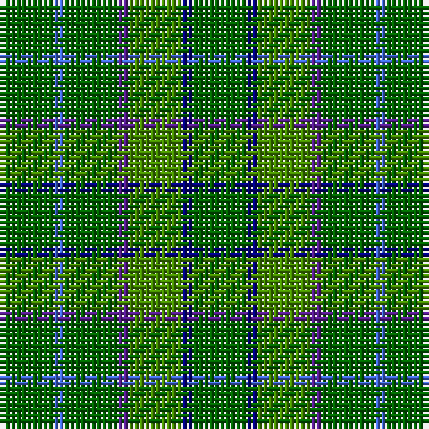

The parent of this is [Blackwood (Loch Wood)](/tartans/g/10/b2/g10/p2/ga10/db2/g/10/)

This was sourced from register-of-tartans.  It is a [7 stripes tartan](/stripes/stripes7/).

Original link https://www.tartanregister.gov.uk/tartanDetails.aspx?ref=10201

## Thread count
G/10 B2 G10 P2 Ga10 DB2 G/10

## Palette
Each colour and its ΔE from the base-6 reference it is a variant of.

| Colour | Shade | Base | ΔE (OKLab) |
|---|---|---|---|
| B |  `#4169E1` | B  | 0.18 |
| DB |  `#000080` | B  | 0.14 |
| G |  `#006400` | G  | 0.00 |
| Ga |  `#458B00` | G  | 0.13 |
| P |  `#551A8B` | B  | 0.10 |

# Sample pattern

ID: /variants/g/10/b2/g10/p2/ga10/db2/g/10-b4169e1-db000080-g006400-ga458b00-p551a8b/
