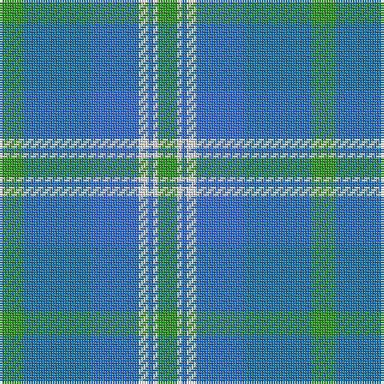

The parent of this is [Earl of St. Andrews (Fashion)](/tartans/g/10/ba28/b20/w4/b2/w2/g/8/)

This was sourced from tartans-authority.  It is a [7 stripes tartan](/stripes/stripes7/).

Original link http://www.tartansauthority.com/tartan-ferret/display/4777/

## Thread count
G/10 Ba28 B20 W4 B2 W2 G/8

## Palette
Each colour and its ΔE from the base-6 reference it is a variant of.

| Colour | Shade | Base | ΔE (OKLab) |
|---|---|---|---|
| B |  `#3070FC` | B  | 0.22 |
| Ba |  `#1474B4` | B  | 0.15 |
| G |  `#289C18` | G  | 0.18 |
| W |  `#F8F8F8` | W  | 0.01 |

# Sample pattern

ID: /variants/g/10/ba28/b20/w4/b2/w2/g/8-b3070fc-ba1474b4-g289c18-wf8f8f8/
