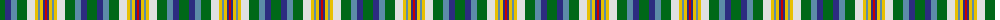

The parent of this is [Northern College Corporate Tartan Tartan Number: 690. Earliest known date: 1983 Northern College, Ontario, Canada See products available Copyright © Blair Urquhart, Comrie, 2015](/tartans/g/10/db6/b6/g10/ln8/y3/b2/y3/db2/r/2/)

This was sourced from house-of-tartan.  It is a [10 stripes tartan](/stripes/stripes10/).

Original link http://www.house-of-tartan.scotland.net/house/TartanViewjs.asp?colr=Def&tnam=690

## Thread count
G/10 DB6 B6 G10 LN8 Y3 B2 Y3 DB2 R/2

## Palette
Each colour and its ΔE from the base-6 reference it is a variant of.

| Colour | Shade | Base | ΔE (OKLab) |
|---|---|---|---|
| B |  `#5C8CA8` | B  | 0.23 |
| DB |  `#2C2C80` | B  | 0.05 |
| G |  `#006818` | G  | 0.02 |
| LN |  `#E0E0E0` | W  | 0.06 |
| R |  `#C80000` | R  | 0.00 |
| Y |  `#E8C000` | Y  | 0.00 |

ID: /variants/g/10/db6/b6/g10/ln8/y3/b2/y3/db2/r/2-b5c8ca8-db2c2c80-g006818-lne0e0e0-rc80000-ye8c000/
