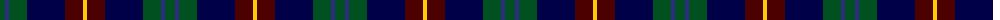

The parent of this is [Lyle and Scott](/tartans/g/10/dba4/g18/db38/dr18/y/4/)

This was sourced from register-of-tartans.  It is a [6 stripes tartan](/stripes/stripes6/).

Original link https://www.tartanregister.gov.uk/tartanDetails.aspx?ref=11139

## Thread count
G/10 DBa4 G18 DB38 DR18 Y/4

## Palette
Each colour and its ΔE from the base-6 reference it is a variant of.

| Colour | Shade | Base | ΔE (OKLab) |
|---|---|---|---|
| DB |  `#000048` | B  | 0.21 |
| DBa |  `#2C2C80` | B  | 0.05 |
| DR |  `#4C0000` | B  | 0.24 |
| G |  `#005020` | G  | 0.08 |
| Y |  `#FCCC00` | Y  | 0.04 |

# Sample pattern

ID: /variants/g/10/dba4/g18/db38/dr18/y/4-db000048-dba2c2c80-dr4c0000-g005020-yfccc00/
