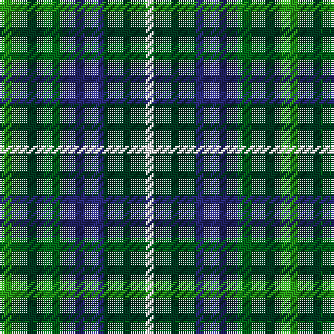

The parent of this is [Pollard (2014)](/tartans/g/10/dg10/ga10/dba10/db10/dg20/w/4/)

This was sourced from tartans-authority.  It is a [7 stripes tartan](/stripes/stripes7/).

Original link http://www.tartansauthority.com/tartan-ferret/display/11151/

## Thread count
G/10 DG10 Ga10 DBa10 DB10 DG20 W/4

## Palette
Each colour and its ΔE from the base-6 reference it is a variant of.

| Colour | Shade | Base | ΔE (OKLab) |
|---|---|---|---|
| DB |  `#2C2C80` | B  | 0.05 |
| DBa |  `#202060` | B  | 0.11 |
| DG |  `#003820` | G  | 0.16 |
| G |  `#289C18` | G  | 0.18 |
| Ga |  `#006818` | G  | 0.02 |
| W |  `#FCFCFC` | W  | 0.03 |

# Sample pattern

ID: /variants/g/10/dg10/ga10/dba10/db10/dg20/w/4-db2c2c80-dba202060-dg003820-g289c18-ga006818-wfcfcfc/
