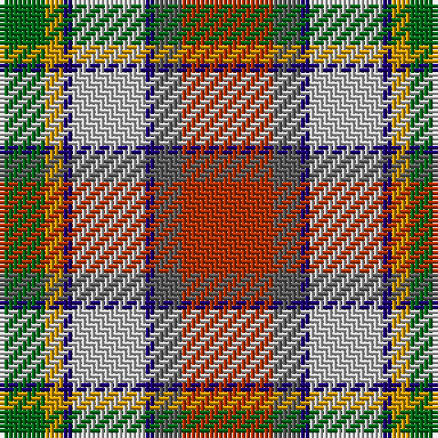

The parent of this is [Porcupine City of (District)](/tartans/g/10/dy4/db2/na16/db2/n6/r/20/)

This was sourced from tartans-authority.  It is a [7 stripes tartan](/stripes/stripes7/).

Original link http://www.tartansauthority.com/tartan-ferret/display/5493/

## Thread count
G/10 DY4 DB2 Na16 DB2 N6 R/20

## Palette
Each colour and its ΔE from the base-6 reference it is a variant of.

| Colour | Shade | Base | ΔE (OKLab) |
|---|---|---|---|
| DB |  `#1C0070` | B  | 0.14 |
| DY |  `#D09800` | Y  | 0.11 |
| G |  `#006818` | G  | 0.02 |
| N |  `#5C5C5C` | B  | 0.14 |
| Na |  `#C0C0C0` | W  | 0.16 |
| R |  `#B03000` | R  | 0.05 |

# Sample pattern

ID: /variants/g/10/dy4/db2/na16/db2/n6/r/20-db1c0070-dyd09800-g006818-n5c5c5c-nac0c0c0-rb03000/
