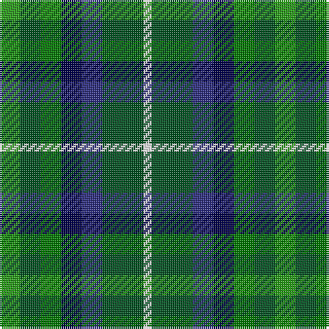

The parent of this is [Pollard (2014)](/tartans/g/10/gb10/ga10/db10/dba10/gb20/w/4/)

This was sourced from register-of-tartans.  It is a [7 stripes tartan](/stripes/stripes7/).

Original link https://www.tartanregister.gov.uk/tartanDetails.aspx?ref=11151

## Thread count
G/10 Gb10 Ga10 DB10 DBa10 Gb20 W/4

## Palette
Each colour and its ΔE from the base-6 reference it is a variant of.

| Colour | Shade | Base | ΔE (OKLab) |
|---|---|---|---|
| DB |  `#000048` | B  | 0.21 |
| DBa |  `#2C2C80` | B  | 0.05 |
| G |  `#289C18` | G  | 0.18 |
| Ga |  `#007800` | G  | 0.06 |
| Gb |  `#005020` | G  | 0.08 |
| W |  `#FFFFFF` | W  | 0.03 |

# Sample pattern

ID: /variants/g/10/gb10/ga10/db10/dba10/gb20/w/4-db000048-dba2c2c80-g289c18-ga007800-gb005020-wffffff/
