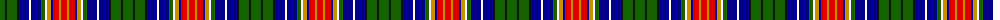

The parent of this is [Festival Celtique de Québec](/tartans/g/10/k2/g10/k2/db10/w2/db10/g4/w2/dy4/db2/r6/dy2/r/6/)

This was sourced from register-of-tartans.  It is a [14 stripes tartan](/stripes/stripes14/).

Original link https://www.tartanregister.gov.uk/tartanDetails.aspx?ref=11047

## Thread count
G/10 K2 G10 K2 DB10 W2 DB10 G4 W2 DY4 DB2 R6 DY2 R/6

## Palette
Each colour and its ΔE from the base-6 reference it is a variant of.

| Colour | Shade | Base | ΔE (OKLab) |
|---|---|---|---|
| DB |  `#00008C` | B  | 0.13 |
| DY |  `#C88C00` | Y  | 0.15 |
| G |  `#146400` | G  | 0.01 |
| K |  `#101010` | K  | 0.17 |
| R |  `#DC0000` | R  | 0.04 |
| W |  `#FFFFFF` | W  | 0.03 |

ID: /variants/g/10/k2/g10/k2/db10/w2/db10/g4/w2/dy4/db2/r6/dy2/r/6-db00008c-dyc88c00-g146400-k101010-rdc0000-wffffff/
