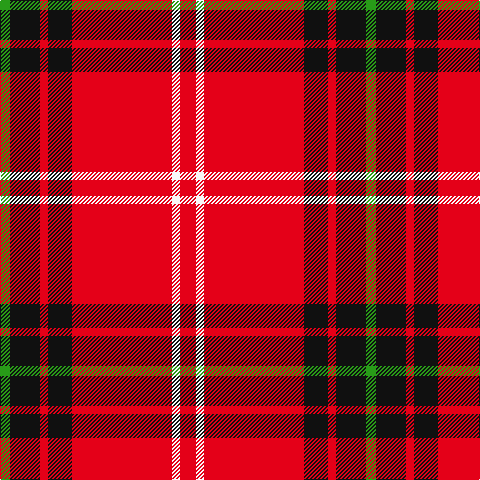

The parent of this is [Instakilt, Red (Fashion)](/tartans/g/10/k30/r8/k24/r100/w8/r/16/)

This was sourced from tartans-authority.  It is a [7 stripes tartan](/stripes/stripes7/).

Original link http://www.tartansauthority.com/tartan-ferret/display/7549/

## Thread count
G/10 K30 R8 K24 R100 W8 R/16

## Palette
Each colour and its ΔE from the base-6 reference it is a variant of.

| Colour | Shade | Base | ΔE (OKLab) |
|---|---|---|---|
| G |  `#289C18` | G  | 0.18 |
| K |  `#101010` | K  | 0.17 |
| R |  `#E40018` | R  | 0.06 |
| W |  `#F8F8F8` | W  | 0.01 |

# Sample pattern

ID: /variants/g/10/k30/r8/k24/r100/w8/r/16-g289c18-k101010-re40018-wf8f8f8/
