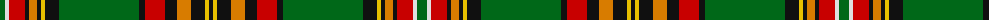

The parent of this is [Goldstraw (Name)](/tartans/g/10/ln4/r16/k4/o8/k4/y4/k14/g80/k6/r20/k12/o14/k14/y4/k/4/)

This was sourced from tartans-authority.  It is a [16 stripes tartan](/stripes/stripes16/).

Original link http://www.tartansauthority.com/tartan-ferret/display/5722/

## Thread count
G/10 LN4 R16 K4 O8 K4 Y4 K14 G80 K6 R20 K12 O14 K14 Y4 K/4

## Palette
Each colour and its ΔE from the base-6 reference it is a variant of.

| Colour | Shade | Base | ΔE (OKLab) |
|---|---|---|---|
| G |  `#006818` | G  | 0.02 |
| K |  `#101010` | K  | 0.17 |
| LN |  `#E0E0E0` | W  | 0.06 |
| O |  `#D87C00` | Y  | 0.17 |
| R |  `#C80000` | R  | 0.00 |
| Y |  `#E8C000` | Y  | 0.00 |

ID: /variants/g/10/ln4/r16/k4/o8/k4/y4/k14/g80/k6/r20/k12/o14/k14/y4/k/4-g006818-k101010-lne0e0e0-od87c00-rc80000-ye8c000/
