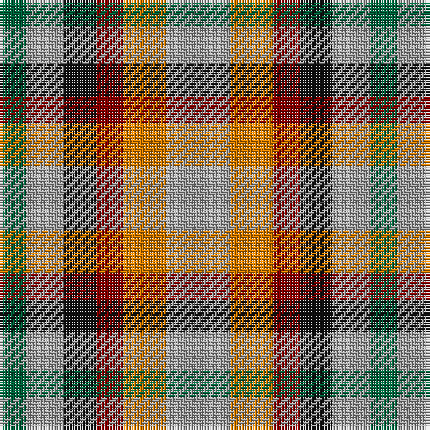

The parent of this is [Mitchell, Martin (Personal)](/tartans/g/10/n14/k12/dr10/o16/n/24/)

This was sourced from register-of-tartans.  It is a [6 stripes tartan](/stripes/stripes6/).

Original link https://www.tartanregister.gov.uk/tartanDetails.aspx?ref=11501

## Thread count
G/10 N14 K12 DR10 O16 N/24

## Palette
Each colour and its ΔE from the base-6 reference it is a variant of.

| Colour | Shade | Base | ΔE (OKLab) |
|---|---|---|---|
| DR |  `#880000` | R  | 0.14 |
| G |  `#00643C` | G  | 0.06 |
| K |  `#101010` | K  | 0.17 |
| N |  `#A0A0A0` | Y  | 0.20 |
| O |  `#D87C00` | Y  | 0.17 |

# Sample pattern

ID: /variants/g/10/n14/k12/dr10/o16/n/24-dr880000-g00643c-k101010-na0a0a0-od87c00/
