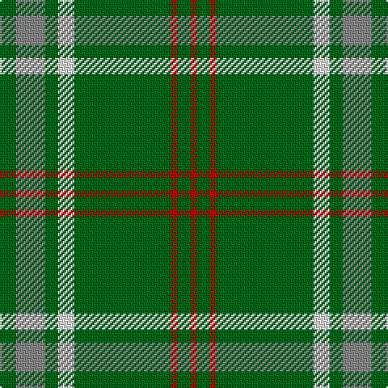

The parent of this is [Welsh Assembly Commemorative Tartan Tartan Number: 2524. Earliest known date: 1999 Welsh Assembly See products available Copyright © Blair Urquhart, Comrie, 2015](/tartans/g/10/n18/g8/ln10/g60/r4/g8/r/4/)

This was sourced from house-of-tartan.  It is a [8 stripes tartan](/stripes/stripes8/).

Original link http://www.house-of-tartan.scotland.net/house/TartanViewjs.asp?colr=Def&tnam=2524

## Thread count
G/10 N18 G8 LN10 G60 R4 G8 R/4

## Palette
Each colour and its ΔE from the base-6 reference it is a variant of.

| Colour | Shade | Base | ΔE (OKLab) |
|---|---|---|---|
| G |  `#006818` | G  | 0.02 |
| LN |  `#E0E0E0` | W  | 0.06 |
| N |  `#888888` | R  | 0.24 |
| R |  `#C80000` | R  | 0.00 |

# Sample pattern

ID: /variants/g/10/n18/g8/ln10/g60/r4/g8/r/4-g006818-lne0e0e0-n888888-rc80000/
