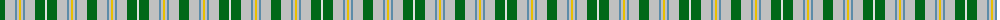

The parent of this is [MacGiboney Dress](/tartans/g/10/na10/b2/na2/y2/na2/b2/na10/g10/ln/2/)

This was sourced from register-of-tartans.  It is a [10 stripes tartan](/stripes/stripes10/).

Original link https://www.tartanregister.gov.uk/tartanDetails.aspx?ref=4901

## Thread count
G/10 Na10 B2 Na2 Y2 Na2 B2 Na10 G10 LN/2

## Palette
Each colour and its ΔE from the base-6 reference it is a variant of.

| Colour | Shade | Base | ΔE (OKLab) |
|---|---|---|---|
| B |  `#5C8CA8` | B  | 0.23 |
| DB |  `#2C2C80` | B  | 0.05 |
| G |  `#006818` | G  | 0.02 |
| LN |  `#E0E0E0` | W  | 0.06 |
| N |  `#888888` | R  | 0.24 |
| Na |  `#C0C0C0` | W  | 0.16 |
| W |  `#F8F8F8` | W  | 0.01 |
| Y |  `#E8C000` | Y  | 0.00 |

ID: /variants/g/10/na10/b2/na2/y2/na2/b2/na10/g10/ln/2-b5c8ca8-db2c2c80-g006818-lne0e0e0-n888888-nac0c0c0-wf8f8f8-ye8c000/
