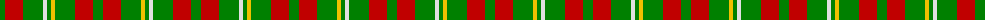

The parent of this is [Wilson's, No 169](/tartans/g/10/r18/g20/ln4/g4/y4/g20/r18/g/10/)

This was sourced from weddslist.  It is a [9 stripes tartan](/stripes/stripes9/).

Original link http://www.weddslist.com/cgi-bin/tartans/pg.pl?source=sts

## Thread count
G/10 R18 G20 LN4 G4 Y4 G20 R18 G/10

## Palette
Each colour and its ΔE from the base-6 reference it is a variant of.

| Colour | Shade | Base | ΔE (OKLab) |
|---|---|---|---|
| G |  `#008000` | G  | 0.09 |
| LN |  `#E0E0E0` | W  | 0.06 |
| R |  `#C00000` | R  | 0.02 |
| Y |  `#F0C000` | Y  | 0.01 |

ID: /variants/g/10/r18/g20/ln4/g4/y4/g20/r18/g/10-g008000-lne0e0e0-rc00000-yf0c000/
