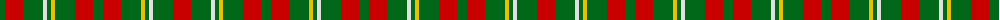

The parent of this is [Wilson's No.169](/tartans/g/10/r18/g20/ln4/g4/y4/g20/r18/g10/r18/g20/y4/g4/ln4/g20/r/18/)

This was sourced from register-of-tartans.  It is a [16 stripes tartan](/stripes/stripes16/).

Original link https://www.tartanregister.gov.uk/tartanDetails.aspx?ref=4709

## Thread count
G/10 R18 G20 LN4 G4 Y4 G20 R18 G10 R18 G20 Y4 G4 LN4 G20 R/18

## Palette
Each colour and its ΔE from the base-6 reference it is a variant of.

| Colour | Shade | Base | ΔE (OKLab) |
|---|---|---|---|
| DG |  `#003820` | G  | 0.16 |
| G |  `#006818` | G  | 0.02 |
| LN |  `#E0E0E0` | W  | 0.06 |
| R |  `#C80000` | R  | 0.00 |
| Y |  `#E8C000` | Y  | 0.00 |

ID: /variants/g/10/r18/g20/ln4/g4/y4/g20/r18/g10/r18/g20/y4/g4/ln4/g20/r/18-dg003820-g006818-lne0e0e0-rc80000-ye8c000/
