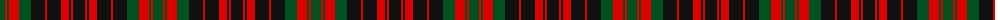

The parent of this is [MacDonald #8](/tartans/g/10/r2/g2/r10/g12/k14/r2/k14/r8/k2/r2/k/12/)

This was sourced from register-of-tartans.  It is a [12 stripes tartan](/stripes/stripes12/).

Original link https://www.tartanregister.gov.uk/tartanDetails.aspx?ref=2341

## Thread count
G/10 R2 G2 R10 G12 K14 R2 K14 R8 K2 R2 K/12

## Palette
Each colour and its ΔE from the base-6 reference it is a variant of.

| Colour | Shade | Base | ΔE (OKLab) |
|---|---|---|---|
| G |  `#005020` | G  | 0.08 |
| K |  `#101010` | K  | 0.17 |
| R |  `#DC0000` | R  | 0.04 |

ID: /variants/g/10/r2/g2/r10/g12/k14/r2/k14/r8/k2/r2/k/12-g005020-k101010-rdc0000/
